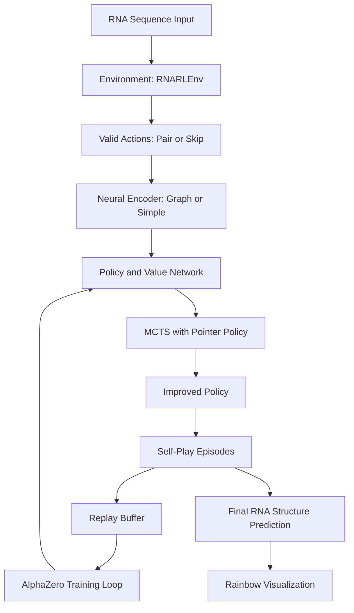

## README.md
RNA folding is usually tackled by dynamic programming and thermodynamic models (e.g., ViennaRNA, RNAstructure).  
This project instead frames folding as a sequential decision process:  

- At each step, the agent decides to **pair** or **skip** a nucleotide.  
- A **Turner-like energy model** provides rewards based on energy stacking/hairpins/loops of a particular structure.  
- A **policy + value neural network** guides MCTS search (like AlphaZero), inspired by the following paper: Mao K, Xiao Y. Learning the Fastest RNA Folding Path Based on Reinforcement Learning and Monte Carlo Tree Search. Molecules. 2021 Jul 22;26(15):4420. doi: 10.3390/molecules26154420. PMID: 34361572; PMCID: PMC8347524.
- The distinction this program made from the 2dRNAFold algorithm is by flexible state space. This program used Pointer-based policy supports variable-length RNAs, and can model infinite(continuous) state space for large RNAs. 

## Installation:
git clone https://github.com/HarryDu-1/Reinforcement-Learning-tool-for-RNA-folding.git
cd Reinforcement-Learning-tool-for-RNA-folding

python -m venv .venv
source .venv/bin/activate

pip install -e .[torch]

pytest -q

##Documentation

##Reinforcement Learning Essentials  

Essential RL ingredients and how they map to RNA folding:

### State Space
-A state is `(i, pairing)` where:
  - `i` is the current nucleotide index being processed.  
  - `pairing` is a list showing which bases are paired/unpaired so far.  
- States encode partial RNA structures during construction.

### Action Space
- At each nucleotide, the agent can:
  - `skip` (leave nucleotide unpaired), or  
  - `pair(i, j)` with a valid downstream base `j`.  
- This makes the action set variable-sized, depending on which pairings are legal at each step.

### Reward Function
- Rewards come from energy changes:
  - Positive reward if the structure becomes more stable (energy decreases).  
  - Penalties for illegal or unstable loops.  
  - Final reward includes `-ΔG` of the completed structure.  
- This encourages the agent to build biophysically favorable structures.

### Value Function 
- The neural network’s value head predicts whether the partial RNA structure can still fold into a stable overall structure.  
- It helps the search balance short-term vs. long-term energy gains.

### Mathematical Overview
- Objective: maximize expected return 
  \n$$ J(\\pi) = \\mathbb{E}_{\\pi} \\left[ \\sum_{t=0}^{T} \\gamma^t r_t \\right] $$  
  where $r_t$ is the reward at step $t$, and $\\gamma$ is the discount factor.  

- Value Function:  
  \n$$ V^{\\pi}(s) = \\mathbb{E}_{\\pi} [ R_t \\mid s_t = s ] $$  

- Action-Value Function:  
  \n$$ Q^{\\pi}(s,a) = \\mathbb{E}_{\\pi} [ R_t \\mid s_t = s, a_t = a ] $$  

- Policy Improvement:  
  - Traditional: choose $a = \\arg\\max_a Q(s,a)$  
  - We used MCTS + neural priors to refine the policy at each state.  
