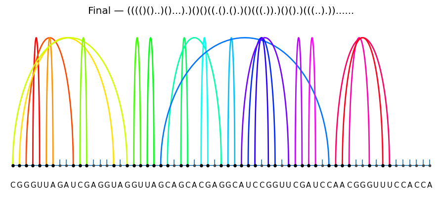

# README.md
RNA folding is usually tackled by dynamic programming and thermodynamic models (e.g., ViennaRNA, RNAstructure).  
This project instead frames folding as a sequential decision process:  

- At each step, the agent decides to **pair** or **skip** a nucleotide.  
- A **Turner-like energy model** provides rewards based on energy stacking/hairpins/loops of a particular structure.  
- A **policy + value neural network** guides MCTS search (like AlphaZero), inspired by the following paper: Mao K, Xiao Y. Learning the Fastest RNA Folding Path Based on Reinforcement Learning and Monte Carlo Tree Search. Molecules. 2021 Jul 22;26(15):4420. doi: 10.3390/molecules26154420. PMID: 34361572; PMCID: PMC8347524.
- The distinction this program made from the 2dRNAFold algorithm is by

      1. Flexible state space. This program used Pointer-based policy supports variable-length RNAs, and can model infinite(continuous) state space for large RNAs.
  
      2. Reward Function. 2dRNA-Fold have their reward function based on folding steps, while this program focused on thermodynamically preferable structure. (Not garenteed MFE)
  
      3. 2dRNA-Fold focused on folding trajectory, while this program focused on the final structure. 


## Installation:
```Python
git clone https://github.com/HarryDu-1/Reinforcement-Learning-tool-for-RNA-folding.git

cd Reinforcement-Learning-tool-for-RNA-folding

python -m venv .venv
source .venv/bin/activate

pip install -e .[torch]

pytest -q
```
# Documentation:

## Command Line:

### random rollout

```Python
python -m scripts.play_random --seq GGGAAACCC
```

### Double Q-learning baseline

```Python
python -m scripts.train_doubleq --seq GCAUCUAG --episodes 2000
```

### AlphaZero-style training
```Python
python -m scripts.train_az --seq GGGAAACCC --iters 50 --episodes_per_iter 8 --batch 32 --device cpu
```

## API

### Energy Function
```Python
from rna_rl.energy import TurnerEnergyModel
E = TurnerEnergyModel()
print(E.total_energy("GGGAAACCC", [8,-1,-1,-1,-1,-1,-1,-1,0]))
```

### Double-Q Learning
```Python
from rna_rl.agents.double_q import DoubleQ
agent = DoubleQ()
```

### AlphaZero Training
```Python
from rna_rl.learners.az_trainer import AlphaZeroTrainer
trainer = AlphaZeroTrainer(encoder="graph")
```

### Visualization:
```Python
from rna_rl.utils.visualize import plot_rainbow
seq = "GGGAAACCC"
pairing = [8,-1,-1,-1,-1,-1,-1,-1,0]
plot_rainbow(seq, pairing, title="Hairpin", save_path="hairpin.png")
```

## Example Output:
E. coli tRNA-Lys-UUU Seq: CGGGUUAGAUCGAGGUAGGUUAGCAGCACGAGGCAUCCGGUUCGAUCCAACGGGUUUCCACCA
Resulting Folding Figure: 
<p align="center">
  
</p>


## Reinforcement Learning Essentials  

Essential RL ingredients and how they map to RNA folding:

### State Space
-A state is `(i, pairing)` where:
  - `i` is the current nucleotide index being processed.  
  - `pairing` is a list showing which bases are paired/unpaired so far.  
- States encode partial RNA structures during construction.

### Action Space
- At each nucleotide, the agent can:
  - `skip` (leave nucleotide unpaired), or  
  - `pair(i, j)` with a valid downstream base `j`.  
- This makes the action set variable-sized, depending on which pairings are legal at each step.

### Reward Function
- Rewards come from energy changes:
  - Positive reward if the structure becomes more stable (energy decreases).  
  - Penalties for illegal or unstable loops.  
  - Final reward includes `-ΔG` of the completed structure.  
- This encourages the agent to build biophysically favorable structures.

### Value Function 
- The neural network’s value head predicts whether the partial RNA structure can still fold into a stable overall structure.  
- It helps the search balance short-term vs. long-term energy gains.
